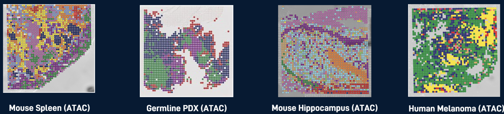
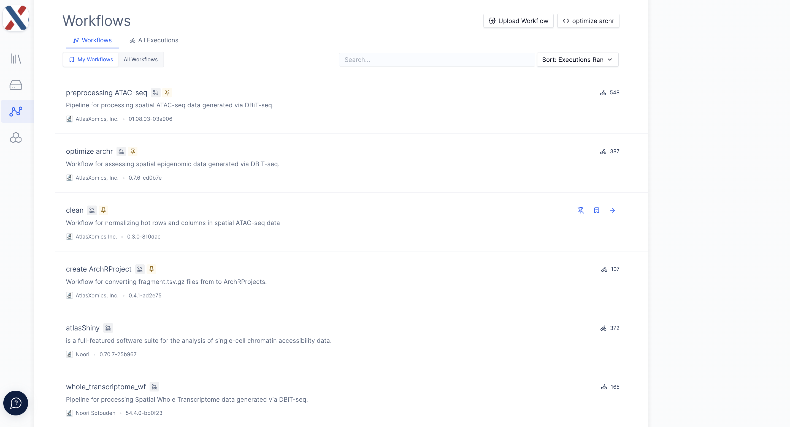

# clean

    

 
 

**clean** is a [latch.bio](https://latch.bio/) workflow for remediating microfluidic artifacts in spatial epigenomic data
generated via [DBiT-seq](https://www.nature.com/articles/s41586-022-05094-1).  Provided outputs from a single-cell ATAC-seq preprocessing and alignment workflow (ie. [Chromap](https://www.nature.com/articles/s41467-021-26865-w), [Cell
Ranger
ATAC](https://support.10xgenomics.com/single-cell-atac/software/pipelines/latest/what-is-cell-ranger-atac)),
and a 'spatial' folder from our
[AtlasXBrowser](https://docs.atlasxomics.com/projects/AtlasXbrowser/en/latest/Overview.html)
app, **clean** returns a fragments.tsv.gz without artifacts and summary statistics from the cleaning.

The workflow identifies outlier rows and columns in which fragment counts are above x (user provided variable) standard deviations of the mean row or column fragment counts.  Fragments of tixels in outlier rows/columns are randomly downsampled to the average fragment count of rows/columns.  The 'cleaned' fragment table is then sorted for continuous chromosome blocks and compressed with gbzip.  The cleaned fragment.tsv.gz file can be used for analysis with ArchR, Seurat, and other scATAC-seq packages.

## Inputs
All input files for **clean** must be on the latch.bio [file system](https://wiki.latch.bio/wiki/data/overview).  

* run id: A string identifier for the experiment; AtlasXomics defaults to standard ATX run notation (ie. Dxxxxx_NGxxxxx.)

* output directory: Name of the directory in the Latch file system that outputs will be saved under; outputs from **clean** are saved in subdirectories of the 'cleaned' directory (`/cleaned/[output directory]/`).

* singlecell file: A comma-separated file output from the ATX **preprocessing ATAC** workflow or another preprocessing and alignment workflow (ie. Cell Ranger ATAC).  Each row in the file corresponds to a cell/tixel barcode, each column to a metric describing fragments in that tixel.  The column 'passed_filters' contains a count of all fragments in tixel and is used to compute row/column averages and outliers.  More information about the singlecell.csv can be found [here](https://support.10xgenomics.com/single-cell-atac/software/pipelines/latest/output/singlecell).

* positions file: A tissue_positions_list.csv containing tixel coordinates and on/off tissue designations for each tixel; this ile is output from the AtlasXBrowser app.

* fragments file: The fragments.tsv.gz file generated from a preprocessing and alignment pipeline; more information on the fragments file can be found [here](https://support.10xgenomics.com/single-cell-atac/software/pipelines/latest/output/fragments).

* standard deviations: Number of standard deviations (1 or 2) above with row/column fragment counts are considered outliers.

* Registry Table ID: Identifier of the latch.bio [registry](https://docs.latch.bio/registry/overview.html) table where run metadata will be recorded.

## Running the workflow

The **clean** workflow can be found in the [Workflows](https://wiki.latch.bio/workflows/overview) module in your latch.bio workspace. For access to an ATX-collaborator workspace, please contact your AtlasXomics Support Scientist or email support@atlasxomics.com.  See [here](https://wiki.latch.bio/workflows/overview) for general instructions for running workflows in latch.bio.

1. Navigate to the **clean** workflow in the Workflows module in your latch.bio workspace.  Ensure you are on the 'Parameters' tab of the workflow.

    

2. Add values to the input parameters fields, according to the descriptions provided above.

    

3. Click the 'Launch Workflow' button on the bottom-right of the parameters page.  This will automatically navigate you to the Executions tab of the workflow.

4. From the Executions tab, you can view the status of the launched workflow.  Once the workflow has completed running, the status will change to 'Succeeded'; if the workflow has the status 'Failed', please contact an AtlasXomics Support Scientist.  You can click on the workflow execution to view a more granular workflow status and see output logs.

5. Workflow outputs are loaded into the latch.bio [data module](https://wiki.latch.bio/wiki/data/overview) in the `cleaned` directory.

## Outputs

Outputs from **clean** are loaded into latch.bio [data module](https://wiki.latch.bio/wiki/data/overview) in the `cleaned` directory.

* cleaned_[run_id]_fragments.tsv.gz: A fragments file with outlier rows/columns downsampled to local averages.

* [run_id]_cleaning_metrics.csv: A comma-separated table containing the following summary statistics:
    * Columns downsampled: Indices (1-based) of columns identified as outliers and downsampled, indexed from left to right.
    * Rows downsampled: Indices (1-based) of rows identified as outliers and downsampled, indexed from left to right.
    * Diagonal downsampled:  T/F for whether the diagonal from the the top-left (1,1) to bottom-right (50,50) was identified as an outlier and downsampled; we have occasionally observed this artifact in DBiT-seq data.
    * Original fragments: Total fragment count for the original fragment file.
    * Final fragments: Total fragment count for the cleaned fragment file.
    * pct_diff: Percent of the original fragment count remaining in the cleaned fragment file (cleaned/original).

## Next Steps

Cleaned fragment files can be used a input in downstream analysis (ArchR, Signac, Seuratm etc.).  Analysis can be performed locally or in a latch.bio [Pod](https://wiki.latch.bio/wiki/pods/overview).  For access to ATX-specific Pods, please contact your AtlasXomics Support Scientist.  

Further analysis can also be performed in latch.bio with the **optimize archr** (returns QC data and tests various input parameters on ArchR clustering), **create ArchRProject** (returns ArchRProject with peak and motif calling) and **atlasShiny** (returns inputs for the ATX ATAC-seq R Shiny App).  For access to these workflows, please contact your AtlasXomics Support Scientist.

## Support
Questions? Comments?  Contact support@atlasxomics.com or post in AtlasXomics [Discord](https://discord.com/channels/1004748539827597413/1005222888384770108).